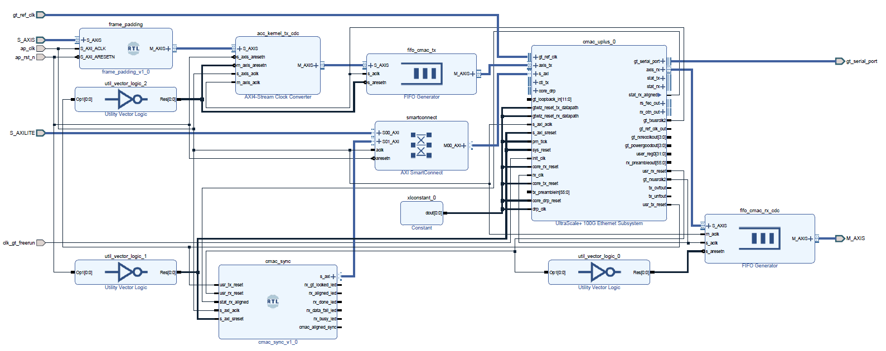

# CMAC Kernel

This documents provides an overview of the cmac kernel.

## The cmac kernel

The `cmac` kernel is an RTL free running kernel which encapsulates the [UltraScale+ Integrated 100G Ethernet Subsystem](https://www.xilinx.com/products/intellectual-property/cmac_usplus.html). The kernel uses `ap_ctrl_none` as hardware control protocol. 

This kernel is configured according to the `INTERFACE` and `DEVICE` arguments passed to make. It exposes two 512-bit AXI4-Stream interfaces (S_AXIS and M_AXIS) to the user logic, which run at the same frequency as the kernel, internally it has CDC (clock domain crossing) logic to convert from kernel clock to the 100G Ethernet Subsystem clock. It also provides and AXI4-Lite interface to check the UltraScale+ Integrated 100G Ethernet Subsystem register map.



### UltraScale+ Integrated 100G Ethernet Subsystem

The 100G Ethernet Subsystem offers an integrated 100 Gigabit per second (Gbps) Ethernet Media Access Controller (MAC), Physical Coding Sublayer (PCS), IEEE 802.3bj Reed-Solomon Forward Error Correction (RS-FEC), and 100GE Auto-Negotiation/Link Training (AN/LT) IP to enable solutions such as KR4, CR4, SR4, CWDM4, PSM4, or ER4f for high performance applications.

> **Note:** RS-FEC and Auto-Negotiation/Link Training are not enabled in this kernel.

### cmac_sync

This IP implements the Core Bring Up Sequence described in the [PG203](https://docs.xilinx.com/v/u/en-US/pg203-cmac-usplus)

### Clock Domain Crossing

The Rx and Tx AXI4-Stream interfaces in the UltraScale+ Integrated 100G Ethernet Subsystem operate at 322.265625 MHz. To accommodate for a different frequency in the rest of the design cross domain crossing is included in the Tx path (acc_kernel_tx_cdc and fifo_cmac_tx) and Rx path (fifo_cmac_rx_cdc).

### Register map

The UltraScale+ Integrated 100G Ethernet Subsystem register map (described in the [PG203](https://docs.xilinx.com/v/u/en-US/pg203-cmac-usplus)) is accessible via the AXI4-Lite interface. Many of these registers have been conveniently mapped into the kernel arguments using the [template.xml](template.xml) file.
If you wish to access a register that is not mapped, you can use the [pynq MMIO](https://pynq.readthedocs.io/en/latest/pynq_package/pynq.mmio.html#module-pynq.mmio) read and write methods.

For instance:

```python
# Read CONFIGURATION_AN_ABILITY register
cmac.read(0xA8)
# Set ctl_an_ability_1000base_kx in the CONFIGURATION_AN_ABILITY register
cmac.read(0xA8, 0x1)
```

You could also modify the [template.xml](template.xml) file to add more registers. Care must be taken when modifying this file, make sure id are properly changed. Once the [template.xml](template.xml) file is modified, you will have to rebuild the design for these changes to be included in the xclbin. Remove all \*.xo files in this folder after changing [template.xml](template.xml).

### Interfaces

| Name           | Description                             |
|----------------|-----------------------------------------|
| ap_clk         | Primary clock                           |
| ap_rst_n       | Primary active-Low reset                |
| clk_gt_freerun | Free running kernel                     |
| gt_ref_clk     | GT reference clock                      |
| gt_serial_port | GT serial lanes                         |
| S_AXILITE      | AXI4-Lite subordinate control interface |
| S_AXIS         | 512-bit AXI4-Stream Tx interface        |
| M_AXIS         | 512-bit AXI4-Stream Rx interface        |

### Multiple 100 GbE Interfaces and Alveo cards

To target multiple 100 GbE interfaces and  Alveo cards a slightly different kernels are generated, the internal structure and interfaces are the same. However, the UltraScale+ Integrated 100G Ethernet Subsystem configuration changes to accommodate each interface and Alveo card. These configurations are cover [here](bd_cmac.tcl#L41-L114).

## License 

To generate the an xclbin file that uses the [UltraScale+ Integrated 100G Ethernet Subsystem](https://www.xilinx.com/products/intellectual-property/cmac_usplus.html) you need a valid license. You can generate a free of charge license following [these steps](https://github.com/Xilinx/open-nic-shell#cmac-license)

> **Note:** To enable Auto-Negotiation/Link Training you would need a separate license. Check the documentation for more information.

## Enabling RS-FEC

To enable RS-FEC, you need to modify the [bd_cmac.tcl](bd_cmac.tcl#147) file and set the `CONFIG.INCLUDE_RS_FEC` to 1. There are also some steps required at runtime, please refer to the [UltraScale+ Integrated 100G Ethernet Subsystem](https://www.xilinx.com/products/intellectual-property/cmac_usplus.html) documentation for more details.

------------------------------------------------------
<p align="center">Copyright&copy; 2022 Xilinx</p>
