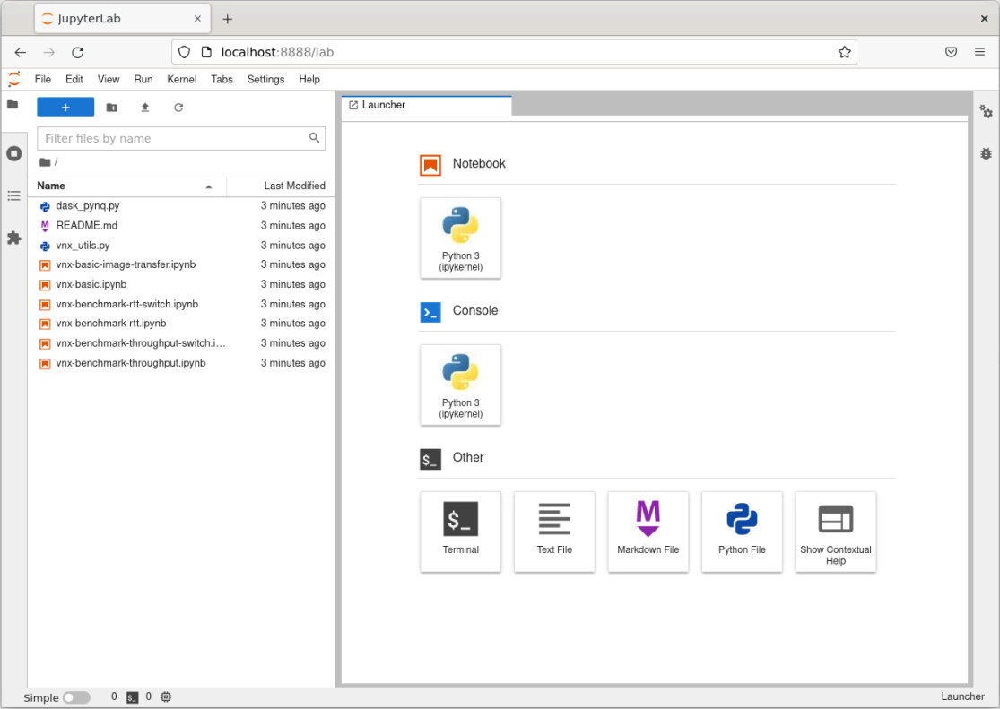

# Companion Notebooks

## Environment

To run these Jupyter notebooks, you will need an environment with JupyterLab and `pynq` installed, the best way to accomplish this is to create a [Python virtual environment](https://docs.python.org/3/library/venv.html#module-venv) or to create a [Conda environment](https://docs.conda.io/projects/conda/en/latest/user-guide/concepts/environments.html#conda-environments).

The steps to Install Conda and get the environment setup are [here](https://pynq.readthedocs.io/en/latest/getting_started/alveo_getting_started.html#install-conda).

## Distributed Alveo cards

The Dask class and Notebooks that use such class are only intended for systems where the Alveo cards are located in different systems, either different servers or different VMs.

For these type of scenarios you can use the Notebooks as it.

## Multiple Alveo cards in the same system

If you have multiple Alveo cards in the same system you can still reuse the Notebooks, but, some modifications are needed.

To begin with, we will use `pynq` to [identify how many Alveo cards are present in the system and their id](https://pynq.readthedocs.io/en/latest/pynq_alveo.html#multiple-cards).

```python
import pynq
for i in range(len(pynq.Device.devices)):
    print("{} {}".format(i, pynq.Device.devices[i].name))
```

An example output should look like this, where the first column is the id and the second one is the Alveo shell

```console
0 xilinx_u280_xdma_201920_3
1 xilinx_u250_xdma_201830_2
2 xilinx_u280_xdma_201920_3
```

In this case, three cards are available. We are only interested in the Alveo U280. To use them the `Overlay` class in `pynq` allows us to specify the device where the `xclbin` file is downloaded.

In the companion Notebooks discard everything before **Download xclbin to workers*** and use this code to configure the Alveo cards. *Replace Alveo id accordingly.*

```python
from vnx_utils import *
import pynq
import numpy as np

xclbin = <xclbin filename replace>
ol_w0 = pynq.Overlay(xclbin, device=pynq.Device.devices[0])
ol_w1 = pynq.Overlay(xclbin, device=pynq.Device.devices[2])
```

You can reuse the rest of the Notebook after this point.

## Getting Started with these Notebooks

To use these notebooks you need `pynq` installed in your system. `pynq` is available in [PYPI](https://pypi.org/project/pynq/), hence you can install it using `pip install pynq`. However, for a smoother and more iterative experience, we recommend to use [JupyterLab](https://jupyterlab.readthedocs.io/en/stable/). As described in the [Environment](#environment) section, the easiest way to accomplish this is to use a [Conda environment](https://docs.conda.io/projects/conda/en/latest/user-guide/concepts/environments.html#conda-environments).

Once `pynq` and `JupyterLab` are installed you can start using these notebooks.

### Launch JupyterLab

It is recommended to launch `JupyterLab` directly from the `Notebooks` directory.

```sh
jupyter lab
```

This will launch a JupyterLab on a web browser.



Double click in any of the notebooks you want to use --- files with extension `*.ipynb`. Learn more about JupyterLab [here](https://jupyterlab.readthedocs.io/en/stable/user/interface.html).

------------------------------------------------------
<p align="center">Copyright&copy; 2022 Xilinx</p>