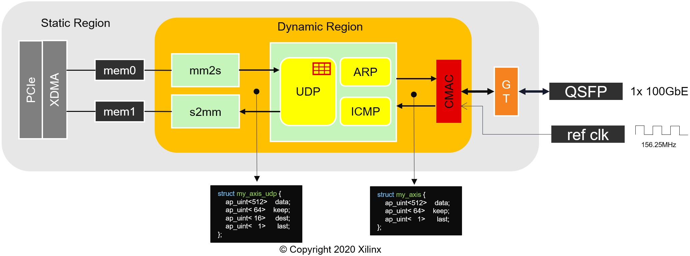

# Vitis Network Layer

This repository contains example designs to provide network support using the GT Kernel option present in most Alveo shells

## Clone this repository

The repository is made of several submodules, therefore, use `--recursive` to clone it.

```sh
git clone https://gitenterprise.xilinx.com/mruiznog/vitis_network_layer.git --recursive
```

## Support

### Tools

| Vitis  | XRT       |
|--------|-----------|
| 2019.2 | 2.5.309   |
| 2020.1 | 2.6.655   |

### Alveo Cards

| Alveo | Shell(s) |
|-------|----------|
| U250  | xilinx_u250_xdma_2020_1 |
| U280  | xilinx_u280_xdma_201920_3 |


## Generate XCLBIN

Run 
```sh
make all DEVICE=<full platform path> INTERFACE=<interface number>
```

* Interface can be 0, 1 or 3 (use both interfaces)
* The basic configuration file is pulled from [config_files](config_files) and complete with `userPostSysLinkOverlayTcl` in the make process

Limitations: 

- Only `xilinx_u280_xdma_201920_3` closes timing


## Block Design

The following figure depicts the different kernels and their interconnection in the Vitis project.



## Notes

The file [advanced.ini](advanced.ini) configures `v++` to call an script. The path of the script must be absolute, therefore, the make process automatically updates `PATHTOTCLFILE` with the full path of the file. The file will appears as modified but SHOULD NOT be staged for commit.