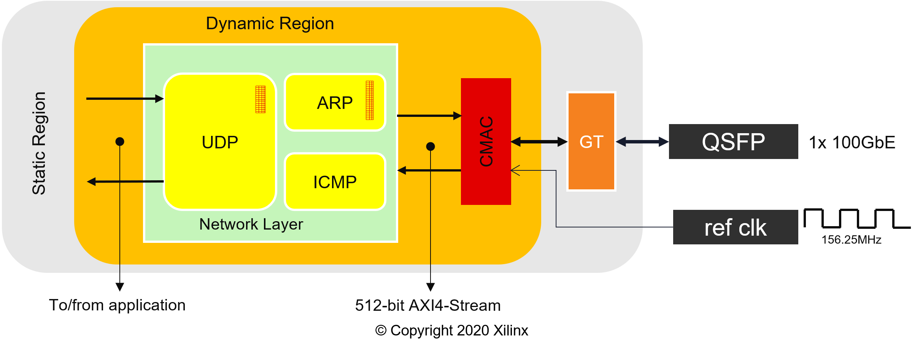
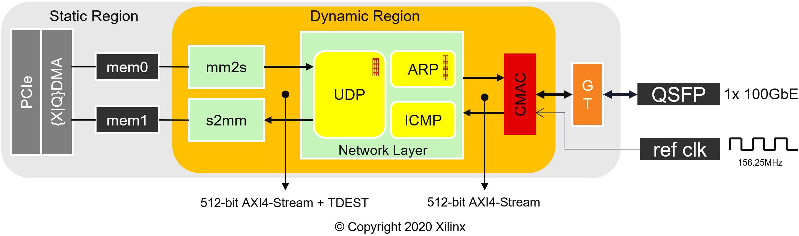
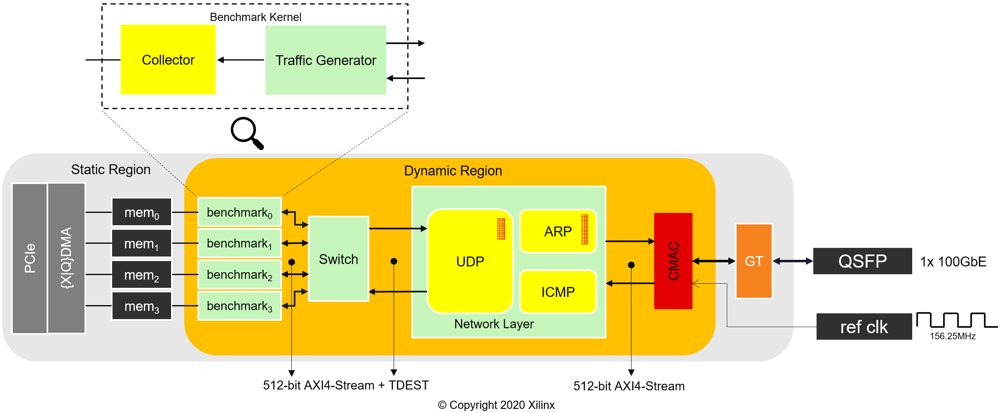

# XUP Vitis Network Example (VNx)

This repository contains IP that you can use to add 100 Gbit/s networking to your Vitis designs. UDP is used as the transport protocol, and allows you to connect your Alveo card to other network equipment or Alveo cards. 

Design examples are provided that show you how to integrate this IP into your Vitis design. One example shows you how to benchmark the network connection and the another shows you how to move data from the host to the network and vice versa. 

The provided IP can be used with any Alveo shell that exposes the QSFP28 Gigabit Transceiver (GT) pins to the dynamic region, [see supported platforms below](#alveo-cards). To find out more check out [Designing a Transceiver-based Application with Vitis](https://developer.xilinx.com/en/articles/designing-a-transceiver-based-application-with-vitus.html).

This repository provides: 

* Source code for the common network infrastructure with UDP support
* Scripts to compile and link the kernels
* Out-of-the-box applications that uses UDP as transport protocol (`basic` and `benchmark`)
* `pynq` host code and helper functions
* DASK integration for multiple FPGAs configuration and task scheduling

## Clone this repository

Get everything you need by cloning the repository, recursively.

```sh
git clone https://github.com/Xilinx/xup_vitis_network_example.git --recursive
```

## Common Infrastructure

This section provides a brief overview of the common infrastructure needed for the examples to work. The examples rely on the same underlying infrastructure, which is `cmac` and `network_layer` kernels.



> **_NOTE:_** the reference clock frequency can change depending on the Alveo card.

### CMAC kernel

The `cmac_kernel` contains an UltraScale+ Integrated 100G Ethernet Subsystem. This kernel is configured according to the `INTERFACE` and `DEVICE` arguments passed to make. It exposes two 512-bit AXI4-Stream interfaces (S_AXIS and M_AXIS) to the user logic, which run at the same frequency as the kernel, internally it has CDC (clock domain crossing) logic to convert from kernel clock to the 100G Ethernet Subsystem clock. It also provides and AXI4-Lite interface to check *cmac* statistics.

For more information check out [Ethernet/README.md](Ethernet/README.md).

### Network Layer kernel

The network layer kernel is a collection of HLS modules to provide basic network functionality. It exposes two 512-bit (with 16-bit TDEST) AXI4-Stream to the application, S_AXIS_sk2nl and M_AXIS_nl2sk.

The ARP table is readable from the host side, and the UDP table is configurable from the host as well. Helper functions to read and configure the tables are available in the class `NetworkLayer` [Notebooks/vnx_utils.py](Notebooks/vnx_utils.py).

The application communicates with the UDP module using *S_AXIS_sk2nl* and *M_AXIS_nl2sk* AXI4-Stream interfaces with the following structure:

```C
struct my_axis_udp {
  ap_uint<512>    data;
  ap_uint< 64>    keep;
  ap_uint< 16>    dest;
  ap_uint<  1>    last;
}
```

In the Rx path, the network layer provides additional metadata in the user signal. To find out more about this kernel check out [NetLayers/README.md](NetLayers/README.md)

## Examples

### Basic

The following figure depicts the different kernels and their interconnection in the Vitis project for the basic example.



> **_NOTE:_** the reference clock frequency can change depending on the Alveo card.

*cmac* and *network layer* kernels are explained in the section above. In this example the application is split into two kernels, memory mapped to stream (mm2s) and stream to memory mapped (s2mm).

* [mm2s](Basic_kernels/src/krnl_mm2s.cpp): pulls data from global memory and converts it to a 512-bit stream. It chunks the data into 1408-Byte packets, meaning that *last* is asserted. It also asserts *last* when there is no more data to send. The *dest* is set according to the argument with the same name.

* [s2mm](Basic_kernels/src/krnl_s2mm.cpp): gets payload from the UDP module and push the payload to global memory. *dest* and *last* are ignored in this module.

The current limitation of this *application* is that the size of the data must be multiple of 64-Byte to work properly.

Check out [vnx-basic](Notebooks/vnx-basic.ipynb) notebook to see how to run this example using `pynq`.

### Benchmark

The following figure depicts the benchmark example design, which contains four *benchmark* kernels. Each benchmark kernel has two modules, traffic generator and collector.



> **_NOTE:_** the reference clock frequency can change depending on the Alveo card.

Find out more information about the benchmark kernel in [Benchmark_kernel/README.md](Benchmark_kernel/README.md)

The following notebooks demonstrate how to use the benchmark example design to measure throughput and latency either point to point or with a switch connection between two Alveo cards.

* [vnx-benchmark-throughput](Notebooks/vnx-benchmark-throughput.ipynb) 
* [vnx-benchmark-throughput-switch](Notebooks/vnx-benchmark-throughput-switch.ipynb)
* [vnx-benchmark-rtt](Notebooks/vnx-benchmark-rtt.ipynb)
* [vnx-benchmark-rtt-switch](Notebooks/vnx-benchmark-rtt-switch.ipynb)

## Support

### Tools

In order to implement this design you need Vitis 2021.1 or newer and associated [XRT](https://github.com/Xilinx/XRT). Older version of the tools are discouraged and will not work.

| Vitis  | XRT       | pynq    | Notes |
|--------|-----------|---------|-------|
| 2021.1 | 2.11.634  | >=2.7   | [Apply Y2K22 patch](https://support.xilinx.com/s/article/76960?language=en_US) |
| 2021.2 | 2.12.427  | >=2.8.0.dev0 | [Apply Y2K22 patch](https://support.xilinx.com/s/article/76960?language=en_US), `pip install pynq==2.8.0.dev0` |
| 2022.1 | 2.13.466  | >=2.8.0.dev0 |  `pip install pynq==2.8.0.dev0`   |

To install `pynq` and JupyterLab follow the steps [here](Notebooks/README.md#environment).

### Alveo Cards

| Alveo | Development Target Platform(s)         | Notes |
|-------|----------------------------------------|-------|
| U50   | xilinx_u50_gen3x16_xdma_201920_3       | [Supported only until 2021.2](https://support.xilinx.com/s/article/33838?language=en_US) |
| U50   | xilinx_u50_gen3x16_xdma_5_202210_1     |       |
| U55C  | xilinx_u55c_gen3x16_xdma_2_202110_1    |       |
| U55C  | xilinx_u55c_gen3x16_xdma_3_202210_1    |       |
| U200  | xilinx_u200_gen3x16_xdma_1_202110_1    |       |
| U250  | xilinx_u250_gen3x16_xdma_3_1_202020_1  | [DFX two-stage platform](https://support.xilinx.com/s/article/75975?language=en_US) |
| U250  | xilinx_u250_gen3x16_xdma_4_1_202210_1  | [DFX two-stage platform](https://support.xilinx.com/s/article/75975?language=en_US) |
| U280  | xilinx_u280_xdma_201920_3              | [Supported only until 2021.2](https://support.xilinx.com/s/article/33838?language=en_US) |

### Requirements

In order to generate this design you will need a valid [UltraScale+ Integrated 100G Ethernet Subsystem](https://www.xilinx.com/products/intellectual-property/cmac_usplus.html) license set up in Vivado.

You also need at least 32GB of RAM available for the implementation. Check Vivado memory requirements [here](https://www.xilinx.com/products/design-tools/vivado/vivado-ml.html#memory).

## Generate XCLBIN

To implement any of the examples run:

```sh
make all DEVICE=<full platform path> INTERFACE=<interface number> DESIGN=<design name>
```

* `DEVICE` Alveo development target platform, [see supported platforms](#alveo-cards)
* `INTERFACE` defines which physical interface is going to be use. 0, 1 or 3 are supported. When `INTERFACE=3` the design will be replicated for each interface. Note that Alveo U50 only has one interface available (`INTERFACE=0`)
* `DESIGN` only support the following strings `basic` and `benchmark`. If you use something different, an error will be reported
* The basic configuration file is pulled from [config_files](config_files) folder and complete with `userPostSysLinkOverlayTcl` parameter before calling `v++`.
* [Ethernet/post_sys_link.tcl](Ethernet/post_sys_link.tcl) is automatically called from `v++` after system link. It is used to connect the GT capable pins to the cmac kernel(s)
* The `XCLBIN` will be generated in the folder \<DESIGN\>.intf_\<INTERFACE\>.\<(short)DEVICE\>


## Repository structure

~~~
├── Basic_kernels
│   └── src
├── Benchmark_kernel
│   └── src
├── config_files
├── Ethernet
│   └── cmac
├── img
├── NetLayers
│   ├── 100G-fpga-network-stack-core
│   └── src
└── Notebooks
~~~

* Basic_kernels: this folder contains the code for the basic application (*mm2s* and *s2mm*)
* Benchmark_kernel: this folder contains the benchmark application, which includes the collector, traffic generator and switch kernels
* config_files: this folder contains the different configuration files for the different examples and flavors
* Ethernet: this folder contains the logic to generate the *cmac* kernel for the different Alveo cards and interfaces
* img: this folder contains images 
* NetLayers: this folder contains the logic to generate the *network\_layer* kernel, using the submodule `100G-fpga-network-stack-core`
* Notebooks: this folder contains companion Jupyter notebooks to show how to run the different examples

## FAQ

### How do I get support?

Open an issue with as much details as you can. Please, use the [issue template](https://github.com/Xilinx/xup_vitis_network_example/issues/new?assignees=&labels=&template=vnx-issue-template.md&title=) and fill in the appropriate fields.

### Alveo card connected to a 100G capable switch/NIC is not getting link.

This design does **NOT** support **FEC neither auto-negotiation** by default. Therefore, make sure that your network equipment has these capabilities disabled. Please, refer to your network equipment manual to accomplish this.

Partial steps to enable RS-FEC are provided [here](Ethernet/README.md#enabling-rs-fec).

### C/C++ host code support?

Python host code in combination with the `pynq` package and JupyterLab as well as DASK provide the right environment to demonstrate the capabilities of this project. A minimalist C/C++ driver contributed from the community is available in the [host_xrt branch](https://github.com/Xilinx/xup_vitis_network_example/tree/host_xrt/host_xrt). We welcome any [contribution](https://github.com/Xilinx/xup_vitis_network_example/blob/host_xrt/CONTRIBUTING.md) to enhance the driver. You can also find (partial) support for some of the kernels [here](https://github.com/Xilinx/HPC/tree/master/xans/sw/src).

### How Can I contribute?

Please, follow the [contributing guidelines](CONTRIBUTING.md)

## Considerations

VXx **IS NOT** a Network Interface Card (NIC). VNx main goal is to provide networking offload to Vitis kernels, so these kernels can communicate from one Alveo card to another without spending CPU cycles and minimum communication latency.

If you are interested in a NIC design, please check out [OpenNIC Platform](https://github.com/Xilinx/open-nic)

VNx was originally developed within [Xilinx University Program](https://www.xilinx.com/support/university.html) to support compute intensive applications that need to scale out. It has now been open sourced by Xilinx as a community resource. VNx is not a **Xilinx product** and so does not have formal Xilinx support in place, [GitHub issues](https://github.com/Xilinx/xup_vitis_network_example/issues) is the best place to request support.

## Licenses

**Vitis Network Example (VNx)** License [BSD 3-Clause License](LICENSE.md)

**Ethernet/cmac** License: [BSD 3-Clause License](THIRD_PARTY_LIC.md)

**NetLayers/100G-fpga-network-stack-core** License: [BSD 3-Clause License](THIRD_PARTY_LIC.md)

------------------------------------------------------
<p align="center">Copyright&copy; 2022 Xilinx</p>
